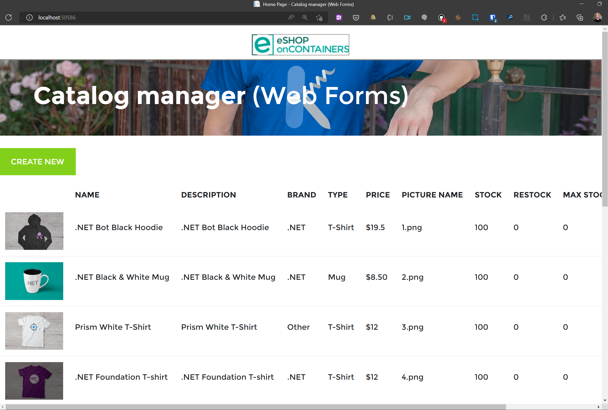

## Step 1 - Getting the app running locally

Before modernising starts, it's best to see the app running and working properly.

Clone or download this GitHub repository, and open the `eShopLegacyWebFormsSolution/eShopLegacyWebForms.sln` file in Visual Studio.

### Compilation Error

If you find you receive a compilation error for roslyn;
> 'Could not find a part of the path '\eShopModernizing\eShopLegacyWebFormsSolution\src\eShopLegacyWebForms\bin\roslyn\csc.exe''

Then this can be resolved by running this command in the Package Manager Console;

```powershell
Update-Package Microsoft.CodeDom.Providers.DotNetCompilerPlatform -r
```

### Running the app

As simple as pressing start, we now have the application working with an in-memory database.


