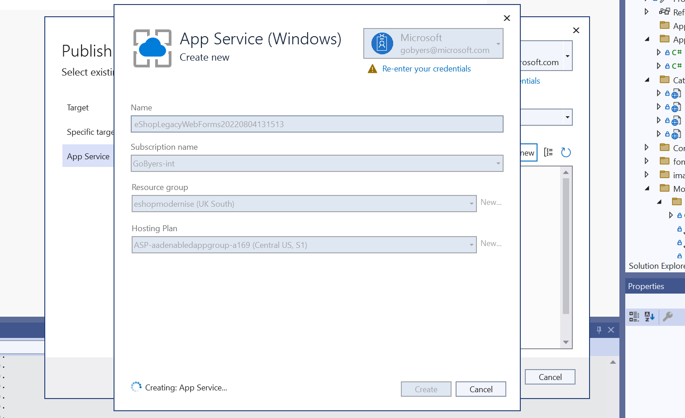
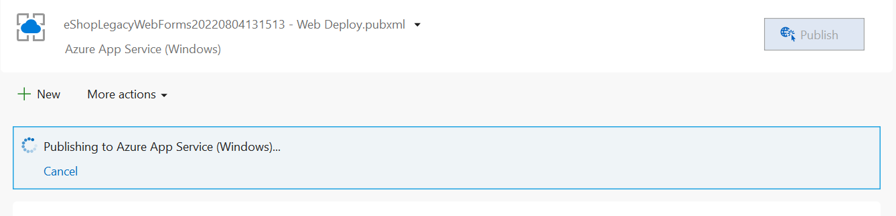

## Step 4 - Deploying to App Service

Visual Studio has Publishing Profiles for deploying your app to a new App Service plan in Azure. Follow the Publishing Wizard to create an App Service Hosting Plan and the Application itself.

Publish the application to Azure.

