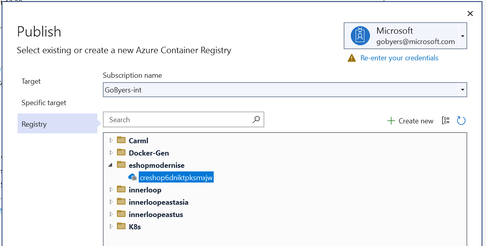
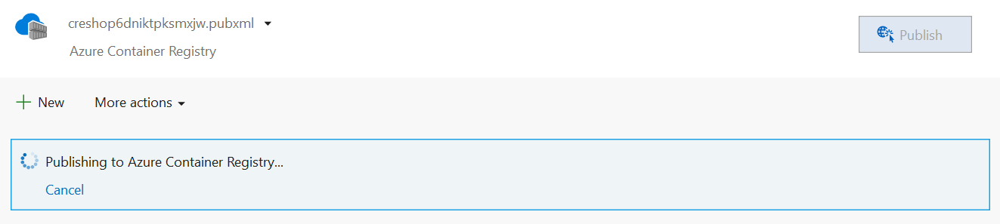
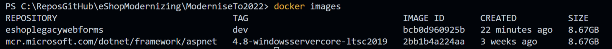
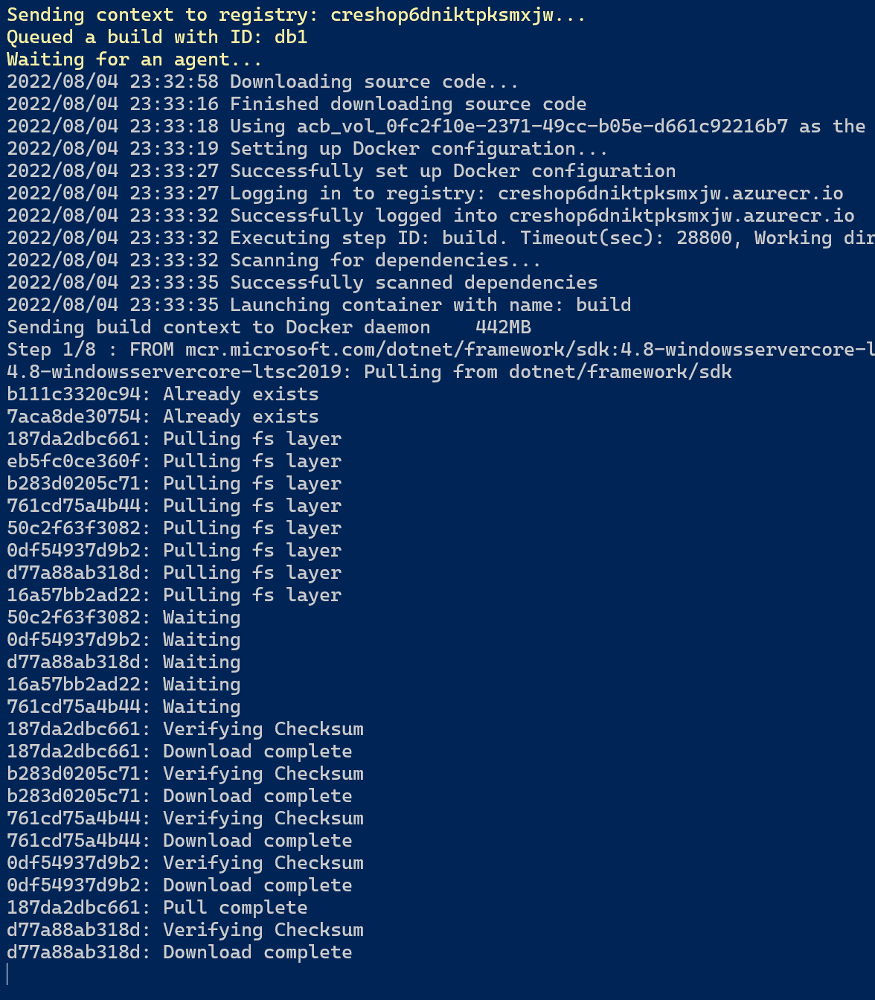
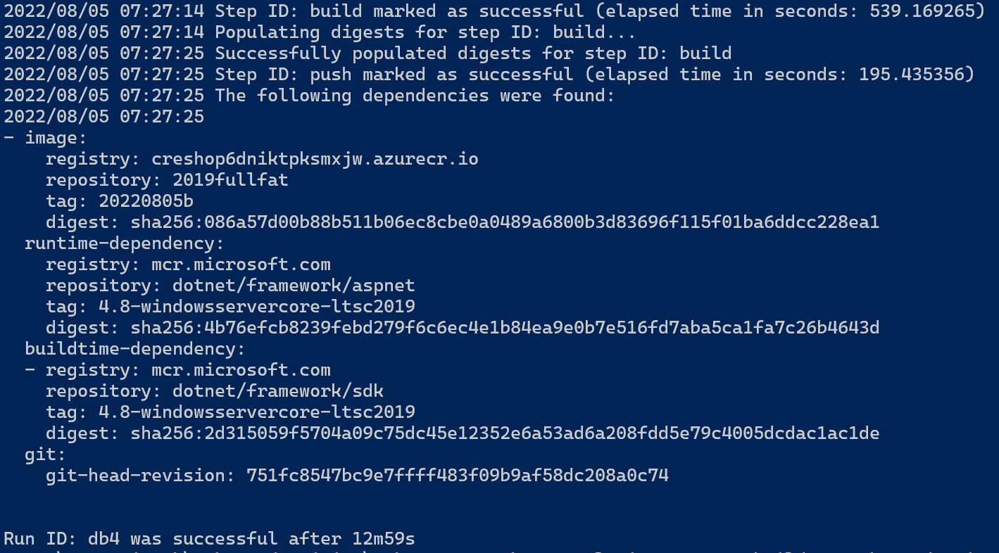

## Step 5 - Windows Containers

Azure App Service provides a simple destination for most web applications. However it does limit the processes that are allowed to run, this can mean for complex applications that have permissive library dependencies - these will normally be blocked, eg.

1. Custom fonts
1. Cultures
1. GAC deployed assemblies
1. GDI libraries

In order to facilitate these more complex applications running in Azure, we need to ship the code in a container or run the code on VM infrastructure.

Visual Studio makes it easy to Containerise the application. You can add a complete Dockerfile by selecting; Project, Add, Docker Support.
Here's what gets generated;

```dockerfile
FROM mcr.microsoft.com/dotnet/framework/aspnet:4.8-windowsservercore-ltsc2019
ARG source
WORKDIR /inetpub/wwwroot
COPY ${source:-obj/Docker/publish} .
```

Now we can run the application locally in a container from Visual Studio.

### Container Registry (ACR)

Azure has a container registry for container image storage, even if you already have a preferred on-premises registry it can be beneficial to use Azure Container Registry in addition because of the integration it has with other Azure services.

Lets create the registry now.

```bash
az deployment group create -g eshopmodernise -f .\acr.bicep
```

### Publishing to ACR from Visual Studio

Now from Visual Studio we can push the image.





This can take some time to upload, and if we run the `docker images` command - then we can see why.



### Creating another Dockerfile

The Dockerfile that was generated by Visual Studio is intended to work an already built application. It works well locally and in CI/CD tools after a build step.
To give us a few more options, we really want to get the Dockerfile to build the Web App by itself. This is what my Dockerfile looks like;

```dockerfile
FROM mcr.microsoft.com/dotnet/framework/sdk:4.8-windowsservercore-ltsc2019 AS build

COPY . ./src/
WORKDIR /src

RUN nuget restore eShopLegacyWebForms.sln
RUN msbuild eShopLegacyWebForms.sln /p:Configuration=Release /p:BuildingProject=true /p:OutDir=..\PUBLISH
#RUN echo $(ls src/PUBLISH/_PublishedWebsites/eShopLegacyWebForms)

FROM mcr.microsoft.com/dotnet/framework/aspnet:4.8-windowsservercore-ltsc2019 AS runtime
WORKDIR /inetpub/wwwroot
COPY --from=build src/src/PUBLISH/_PublishedWebsites/eShopLegacyWebForms/ ./
#RUN echo $(ls)
```

Now when the Dockerfile is called via a straight `docker build .` command, it can produce a working app locally on the dev workstation.

### Building the image with to ACR directly

Building and pushing images locally can take time, all dependant on your internet connection (especially with the size of Windows Containers!). 
A more efficient way to do it is to have the Azure Container Registry build the image itself.

> For ACR to be able to build the Dockerfile it needs to be able to access your source code, [Private Pools](https://docs.microsoft.com/azure/container-registry/tasks-agent-pools) are a preview feature which project the ACR build agents into your private virtual network.

Now we have a free-standing Dockerfile, we can leverage the Azure CLI to initiate the ACR build;

```bash
az acr build -g eshopmodernise -r YOURACRNAME -t 2019fullfat:20220805 https://github.com/Gordonby/eShopModernizing.git#main:eShopLegacyWebFormsSolution --platform windows
```

#### Acr Build Logs






#### Acr run Logs

There is a modererate (25%) variation in build time for the same image as you can see from the run logs

Run Id | Task | Platform | Status | Trigger | Started | Duration
------ | ---- | -------- | ------ | ------- | ------- | --------
ca4 | (Quick Task) | windows | Succeeded | Manual | 10/11/2022, 10:12 AM GMT+1 | 00:21:52
ca3 | (Quick Task) | windows | Succeeded | Manual | 10/11/2022, 10:02 AM GMT+1 | 00:19:23
ca2 | (Quick Task) | windows | Succeeded | Manual | 10/11/2022, 9:03 AM GMT+1 | 00:24:03 
ca1 | (Quick Task) | windows | Succeeded | Manual | 10/11/2022, 8:27 AM GMT+1 | 00:22:54

### Building the image in CI/CD Tooling

#### GitHub

`todo`

#### Azure DevOps

`todo`

### Enhancing the Dockerfile - Software Installation

It's common for legacy applications to have 3rd party dependencies. To install these, we'll use PowerShell to silently install and configure them. We'll walk through different pieces of software and show how to install/configure them.

#### Installing the Azure CLI

It can be super useful installing the Azure CLI into your container, allowing your app to run az commands to communicate with the Azure Control Plane.

```dockerfile
SHELL ["powershell"]
RUN powershell $ProgressPreference = 'SilentlyContinue'; Invoke-WebRequest -Uri https://aka.ms/installazurecliwindows -OutFile .\AzureCLI.msi; Start-Process msiexec.exe -Wait -ArgumentList '/I AzureCLI.msi /quiet'; rm .\AzureCLI.msi
```