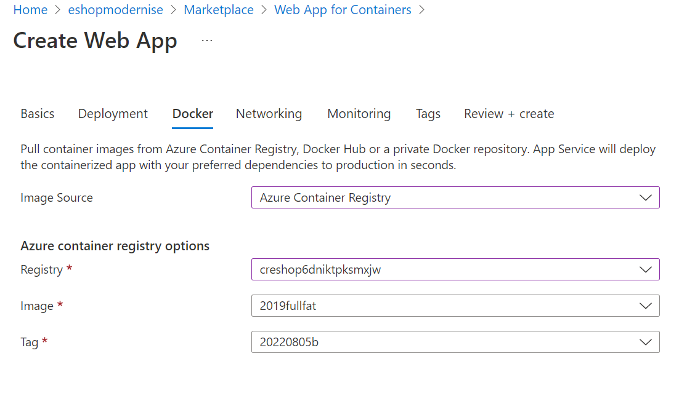
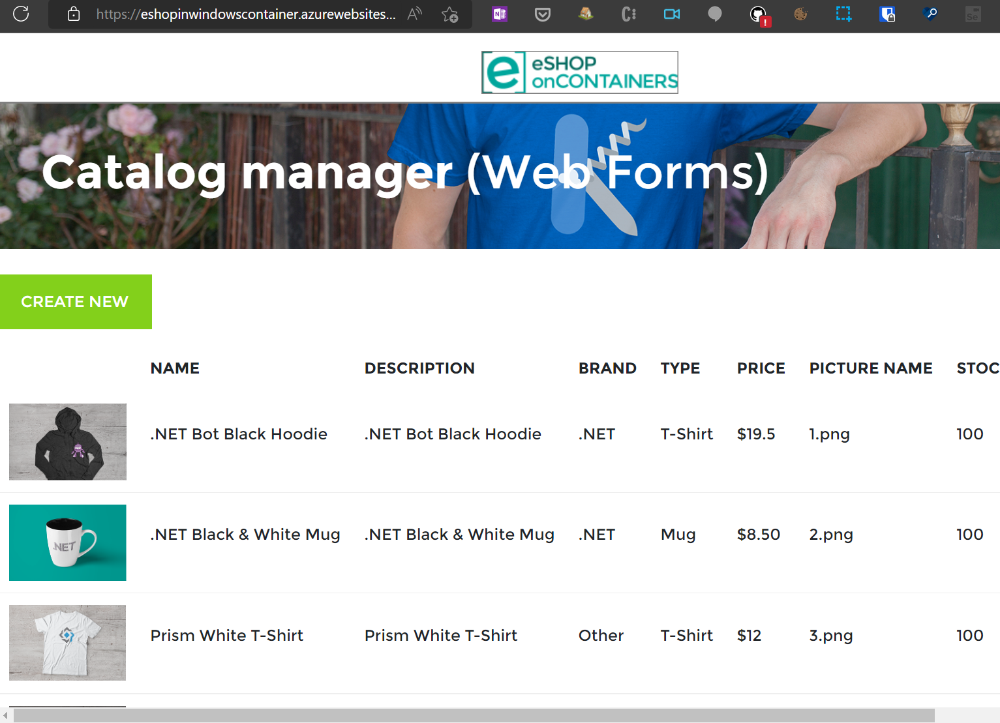

# Step 7 - Deploying to Azure App Service (Containers)

For this step, we'll use the [portal](https://ms.portal.azure.com/#create/Microsoft.AppSvcLinux) to quickly create a Windows OS, Docker Container based Web App. The portal makes light work of pulling our image from the Azure Container Registry.

Once the image has been pulled, the application is available, running from the same Azure Database.

https://docs.microsoft.com/en-gb/azure/app-service/configure-custom-container?pivots=container-linux#use-an-image-from-a-private-registry

## Using Azure AD for SQL Authentication

Managed Identities provide a great way for Azure services to access other Azure services with a clear RBAC system.

An Azure Web Application can be given an identity which is then leveraged when accessing the SQL Database. You will need to change your code to get an access token to use with the SQL database connection.  [Read more](https://docs.microsoft.com/azure/app-service/tutorial-connect-msi-sql-database?tabs=windowsclient%2Cef%2Cdotnet)

### Application Settings

### Key Vault integration

### Observability

1. Logs
1. Application Insights

#### Application Insights

Enable [Auto-Instrumentation](https://azure.github.io/AppService/2022/04/11/windows-containers-app-insights-preview.html) of your Web App Container to automatically attach an agent to the container. It will collect metrics such as requests, dependencies, latency, and stack traces.

### Scalability

[ARR affinity](https://azure.github.io/AppService/2016/05/16/Disable-Session-affinity-cookie-(ARR-cookie)-for-Azure-web-apps.html) is supported.
